# Ultra Focus - Flashcard App

Ultra Focus is a modern, feature-rich spaced repetition flashcard application designed to help you learn and retain information efficiently. Built with Vue 3 and TypeScript, it utilizes the SM-2 algorithm to optimize your study schedules.

## 🚀 Features

-   **Spaced Repetition System (SRS):** Uses a modified SM-2 algorithm to schedule reviews at optimal intervals.
-   **Rich Content Support:** Create cards with Markdown text and Code blocks.
-   **Image Occlusion:** Enhanced learning for anatomy, diagrams, and maps by hiding parts of an image.
-   **Dashboard & Statistics:** Detailed metrics on readiness, streaks, accuracy, and review activity.
-   **Deck Management:** Organize cards into decks with custom colors and descriptions.
-   **Study Modes:** Interactive study sessions with standard difficulty ratings (Forgot, Hard, Good, Easy) and haptic feedback.
-   **Dark Mode:** Fully supported dark theme for comfortable night study, optimized for OLED screens.
-   **Responsive Design:** Mobile-first approach ensuring a great experience on all devices.
-   **Secure Authentication:** User management powered by Supabase Auth.

## 📸 Showcase

<details>
<summary><b>🖥️ Desktop UI (Click Here)</b></summary>
<br>

### Dashboard
*Overview of your learning progress and upcoming reviews.*
<div align="center">
  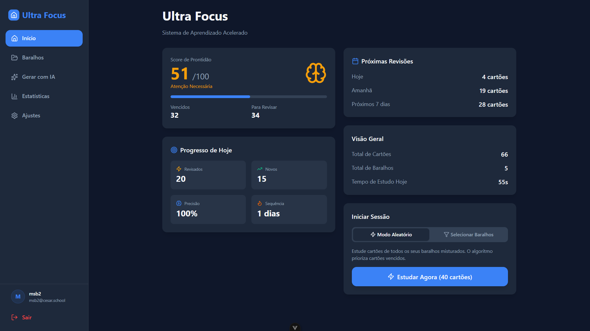
  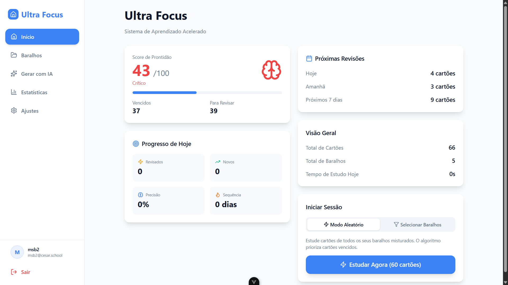
</div>

### Decks & Study Sessions
*Manage your learning materials and study sessions.*
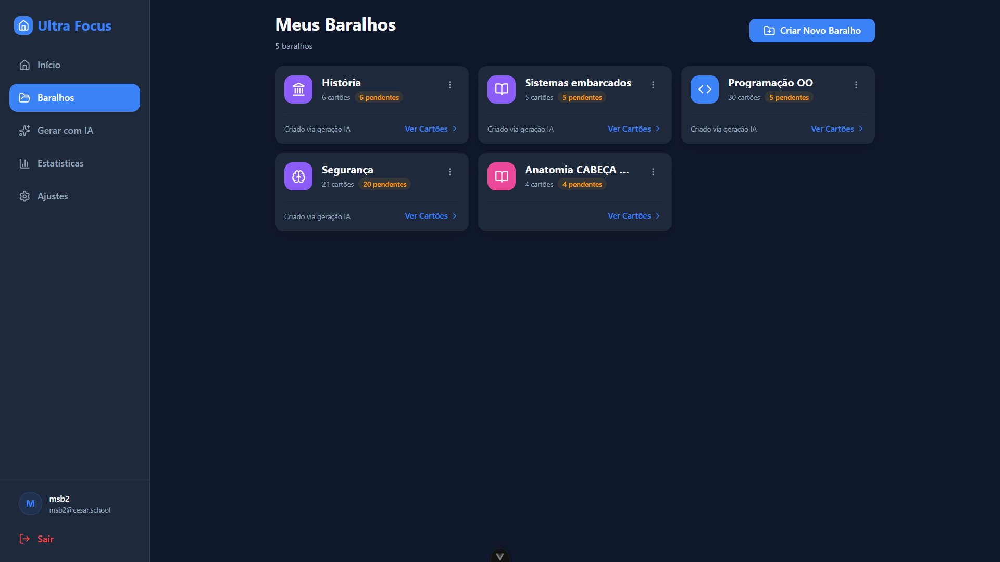
<div align="center">
  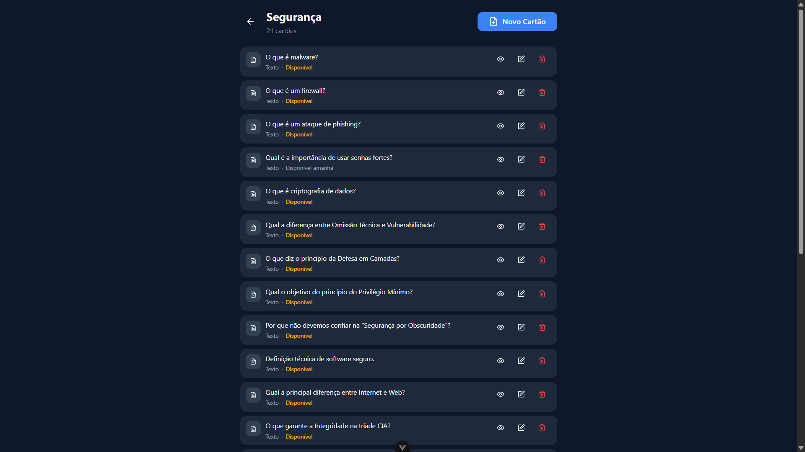
  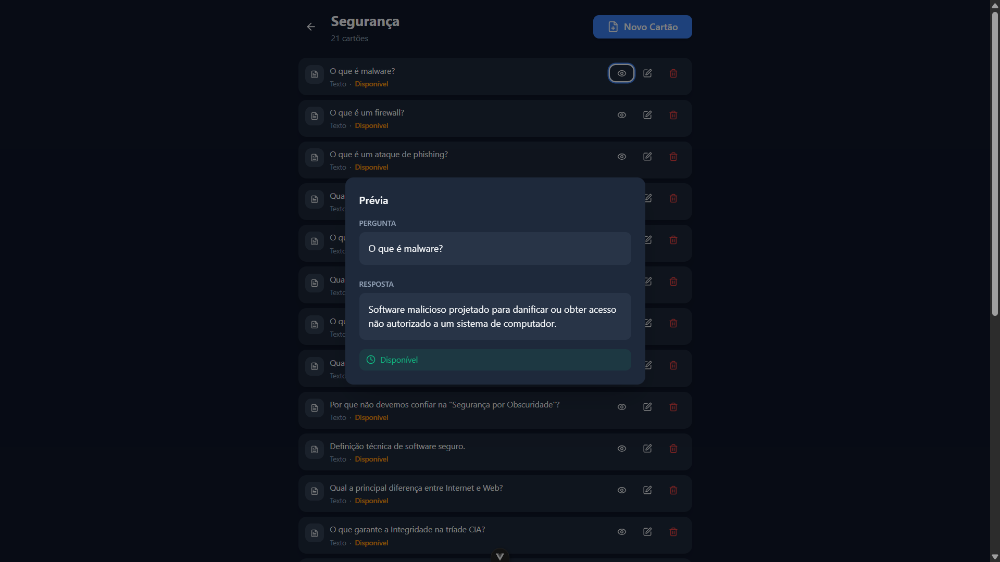
  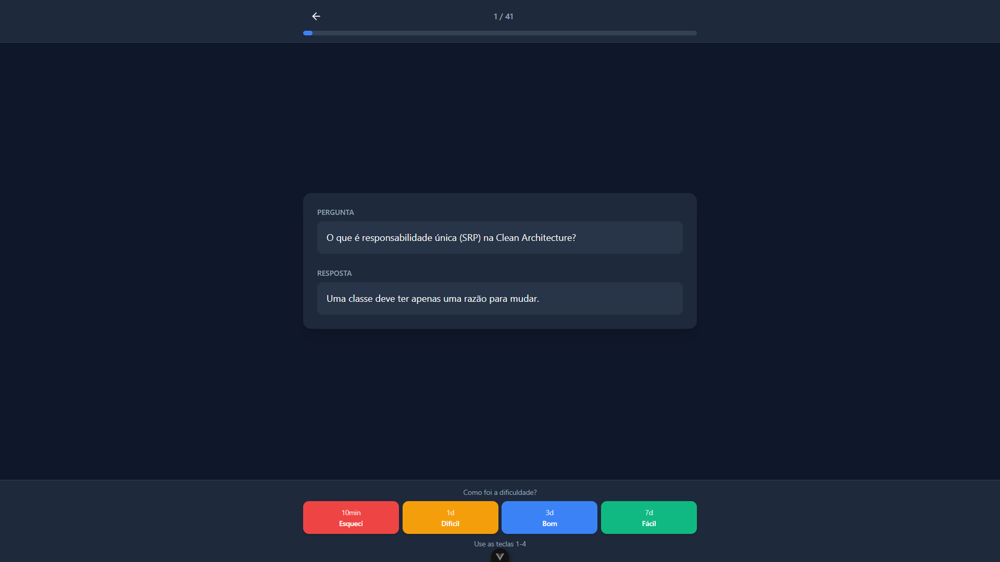
</div>

### Image Occlusion Editor
*Hover/click to reveal labels on images.*
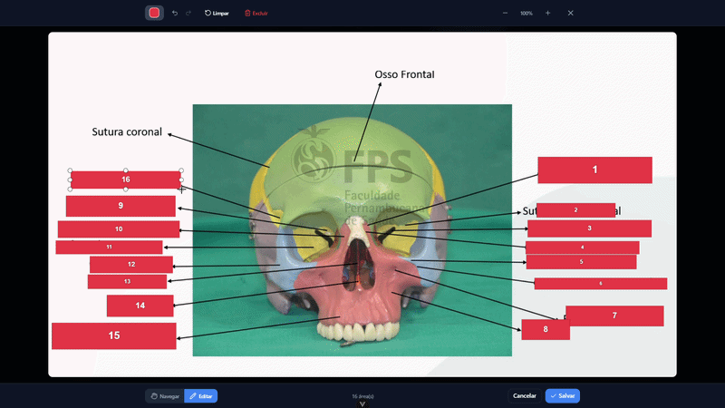

### Features
*AI Generation, Sharing, and Stats.*
<div align="center">
  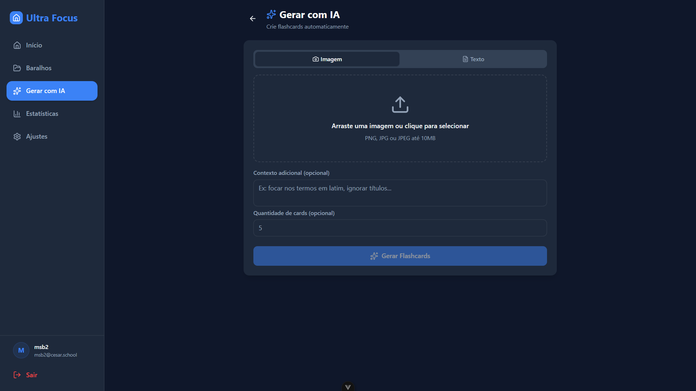
  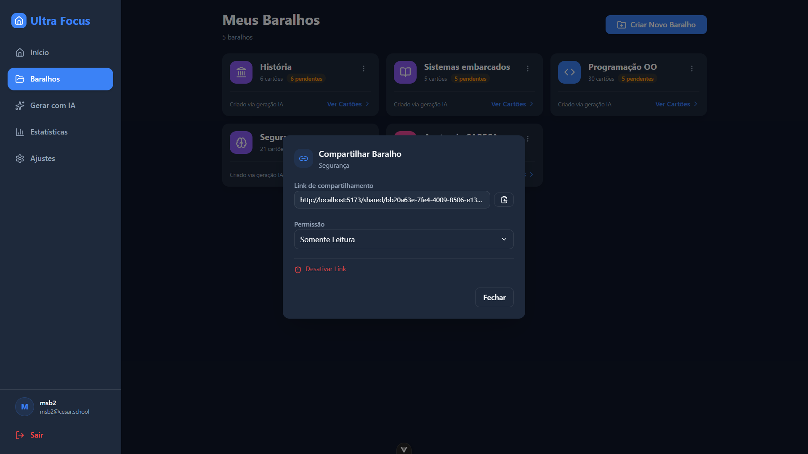
  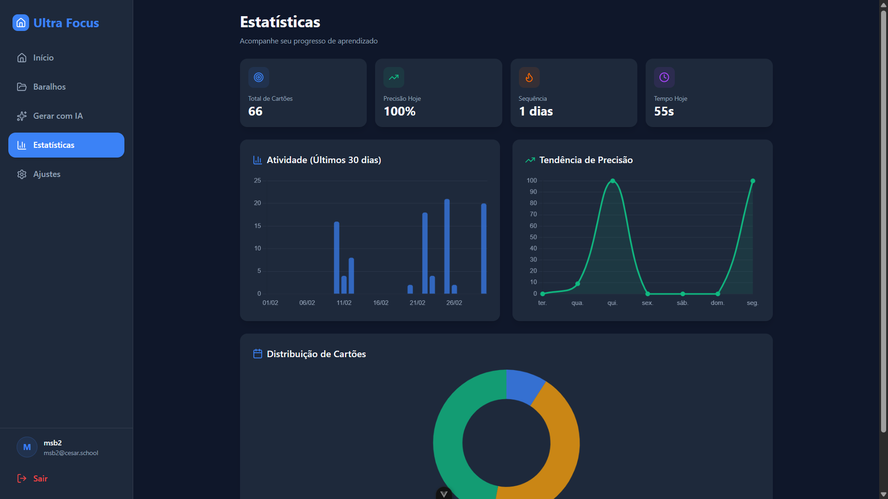
</div>

</details>

<details>
<summary><b>📱 Mobile UI (Click Here)</b></summary>
<br>

### Dashboard & Decks
<div align="center">
  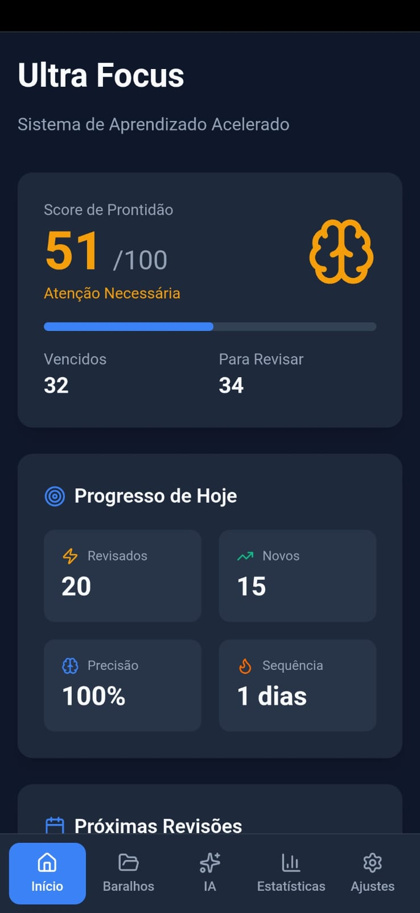
  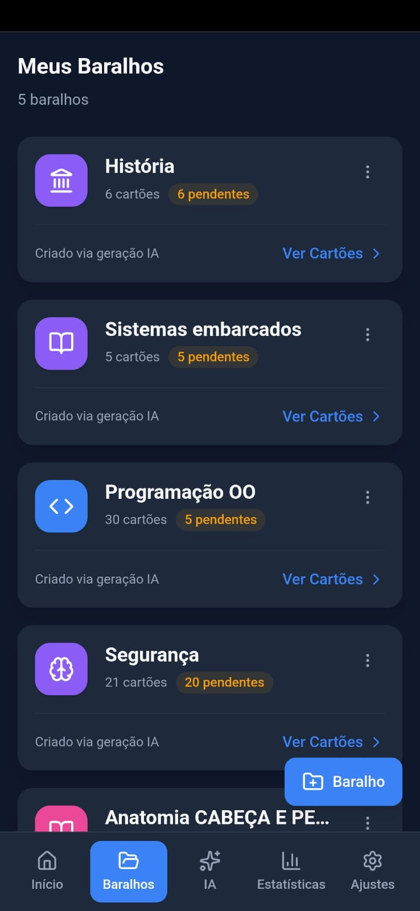
</div>

### Study Sessions
<div align="center">
  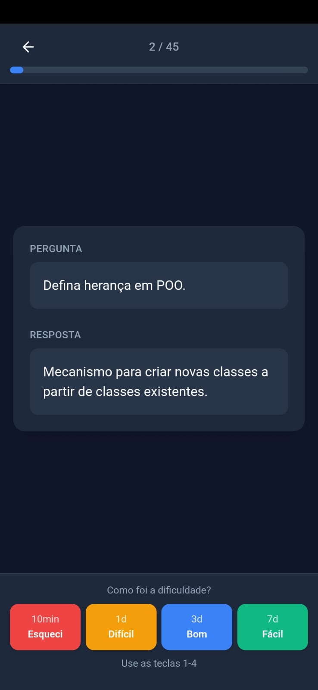
  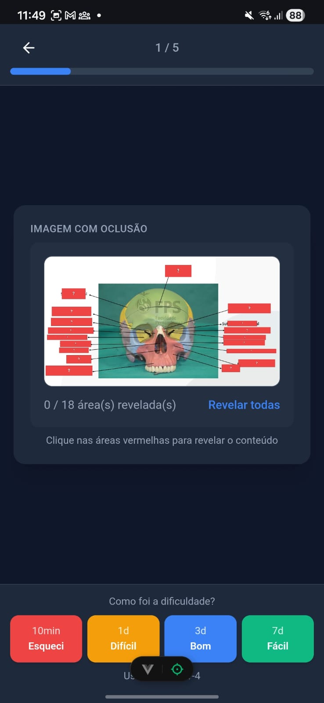
</div>

### Image Occlusion
<div align="center">
  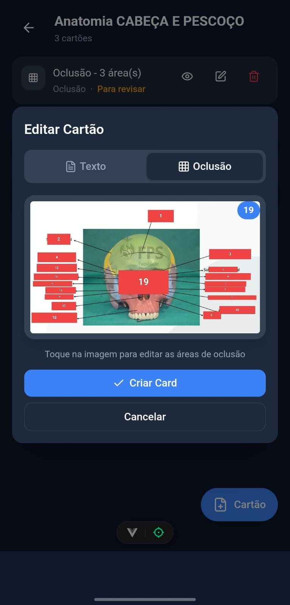
  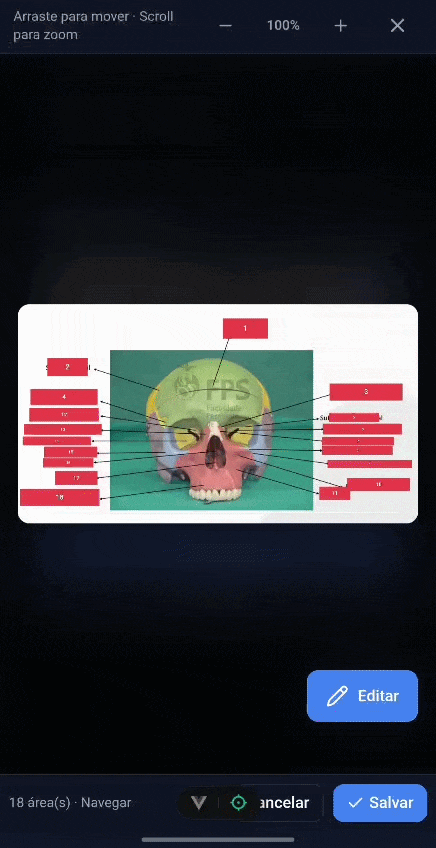
</div>

### Features & Statistics
<div align="center">
  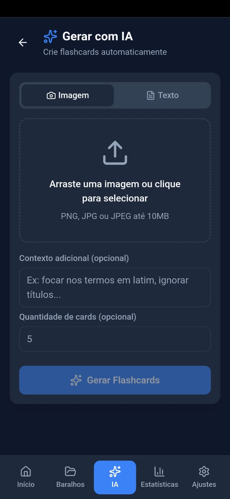
  
</div>
<br>
<div align="center">
  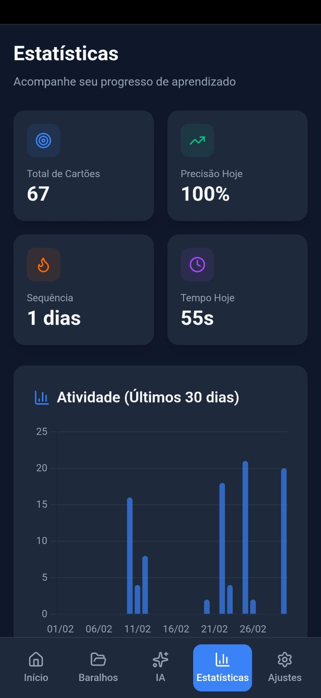
  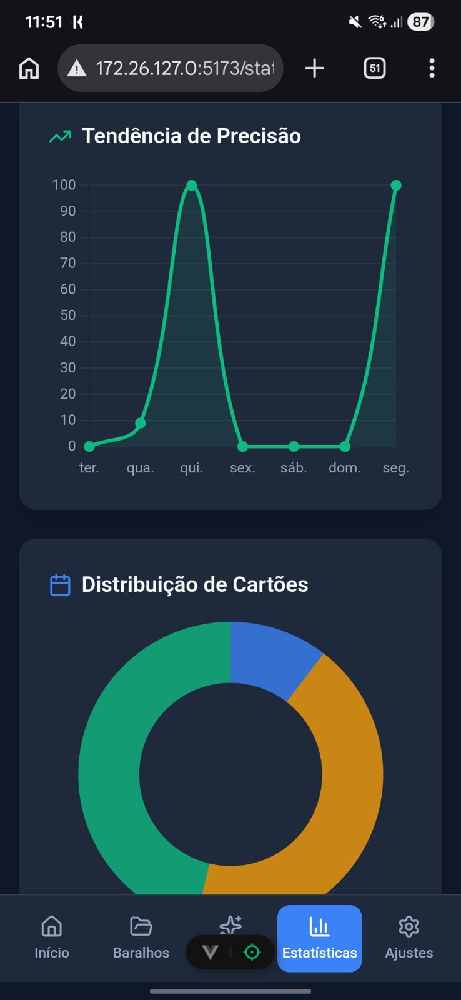
</div>

</details>

## 🛠️ Tech Stack

-   **Framework:** [Vue 3](https://vuejs.org/) (Composition API, Script Setup)
-   **Build Tool:** [Vite](https://vitejs.dev/)
-   **Language:** [TypeScript](https://www.typescriptlang.org/)
-   **State Management:** [Pinia](https://pinia.vuejs.org/)
-   **Styling:** [Tailwind CSS](https://tailwindcss.com/)
-   **Backend / Auth:** [Supabase](https://supabase.com/)
-   **Testing:** [Vitest](https://vitest.dev/)
-   **Icons:** [Lucide Vue](https://lucide.dev/)
-   **Charts:** [Chart.js](https://www.chartjs.org/) with [vue-chartjs](https://vue-chartjs.org/)

## 📋 Prerequisites

-   [Node.js](https://nodejs.org/) (v20+ recommended)
-   [Bun](https://bun.sh/) (Preferred package manager)

## ⚡ Installation

1.  **Clone the repository:**

    ```bash
    git clone <repository-url>
    cd flashcard-app
    ```

2.  **Install dependencies:**

    ```bash
    bun install
    ```

3.  **Environment Setup:**

    Create a `.env` file in the root directory based on your Supabase configuration. You need to have a Supabase project set up.

    ```env
    VITE_SUPABASE_URL=your_supabase_project_url
    VITE_SUPABASE_ANON_KEY=your_supabase_anon_key
    ```

## ▶️ Usage

### Development Server

Start the local development server:

```bash
bun dev
```

The application will be available at `http://localhost:5173`.

### Production Build

Type-check and build the application for production:

```bash
bun run build
```

Preview the production build locally:

```bash
bun preview
```

## 🧪 Testing & Linting

Run unit tests with Vitest:

```bash
bun test:unit
```

Run linting (ESLint):

```bash
bun lint
```

## 📂 Project Structure

-   `src/components`: Reusable UI components.
    -   `ui/`: Base atomic components (Button, Input, Card).
-   `src/views`: Main application pages (Dashboard, Study Session, Deck Manager).
-   `src/stores`: Pinia stores for global state (Auth, Flashcards).
-   `src/services`: Core business logic (Spaced Repetition algorithm).
-   `src/composables`: Reusable Vue composables (Statistics, Notifications).
-   `src/types`: TypeScript interfaces and types.
-   `src/lib`: Third-party library configurations (Supabase).

## 🤝 Contributing

Contributions are welcome! Please feel free to submit a Pull Request.

## 📄 License

This project is licensed under the MIT License.